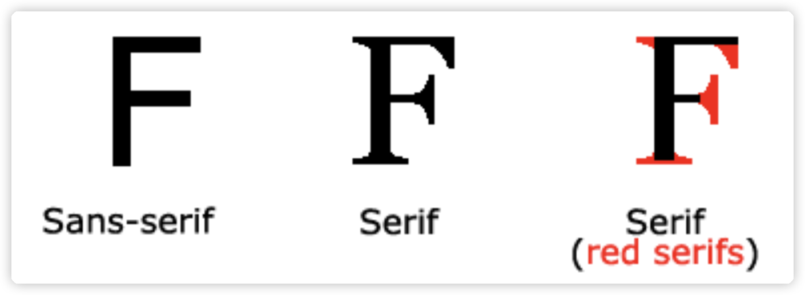
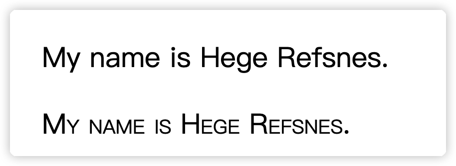

# css_practice

## 一般的语法规则是
```css
选择器 {

	属性1:值1;
	属性2:值2;
}
```
> 选择器通常是我们需要改变样式的HTML元素
	每条声明由一个属性和一个值组成
	CSS 声明总是以分号结束, 声明总是用大括号括起来

## CSS id 和 class

### id 和 class 选择器
&emsp;如果我们需要再HTML元素中设置CSS样式, 我们需要在元素中设"id" 和 "class" 选择器

### id选择器
&emsp;id 选择器可以为标有特定id的HTML元素指定特定的样式

&emsp;HTML元素以id属性来设置id选择器, CSS中id选择器以 **#** 来定义

&emsp;下面的样式规则应用于元素属性 id="para1"

```css

#para1 {
	text-align:center;
	color:red;
}
```
<b style="background-color:white; color:black">id 属性不能以数字开头, 数字开头的id在特定的浏览器中不起作用</b>

### class 选择器

&emsp;class 选择器用于描述一组元素的样式, class选择器有别于id选择器, class可以在多个元素中使用

&emsp;calss 选择器在 HTML 中以class属性表示, 在 CSS 中, 类选择器以一个点 `.` 表示

```css

.center{
	text-align:center;
}
/* html 标签中应该写成 class="center" */

p.center{
	text-align:center;
}
/* html 所有p标签有center类的元素居中*/
```
上面是一个让所有拥有 center 类的HTML元素全部居中

```html

<p class="class1 class2 class3"></p>
<!--多个class选择器可以用空格分开-->
```
> 注意, 类名的第一个字符也不可以使用数字. 因为无法在特定的浏览器中起作用 (Mozilla 和 Firefox)

## CSS 创建

&emsp;当读到一个样式表时, 浏览器会根据样式表来格式化HTML文档

### 如何插入样式表

&emsp;一共有三种方法插入样式表:

* 外部样式表 external style sheet
* 内部样式表 internal style sheet
* 内联样式 inline style

### 外部样式表

&emsp;当样式需要应用于很多页面时, `外部样式表` 是理想的选择, 在使用外部样式表的情况下, 我们可以通过改变`一个文件`来改变整个站点的外观. 每个页面使用 &lt;link&gt;标签链接到样式表.
```html
<head>
	<link rel="stylesheet" type="text/css" href="css_file_location.css">
</head>
```
&emsp;浏览器会从我们提供的css文件地址读取样式声明, 并根据它来格式文档.
外部样式表可以在任何文本编辑器中进行编辑. 文件不能包含任何html标签. 样式表应该以`.css`扩展名进行保存
> 注意: `margin-left:20px` 上面的`20`与`px`之间不可以用空格分开

### 内部样式表

&emsp;当单个文档需要特殊的样式时, 就应该使用内部样式表. 我们可以使用`<style>`标签在文档头部定义内部样式表, 例如:
```html
<head>
	<style>
		hr {
			color:sienna;
		}
		p {
			margin-left:20px;
		}
		body {
			background-image:url("images/back40.gif");
		}
	</style>
</head>
```

### 内联样式

&emsp;由于要将表现和内容混杂在一起, **内联样式表会损失掉样式表的许多优势**. 所以这种方法我们要慎用, 例如当样式仅仅需要在一个元素上应用一次时.

&emsp;要使用内联样式, 我们需要在相关的标签内使用内联样式 `style` 属性. Style属性可以包含任何css属性.
```html
<p style="color:sienna;margin-left:20px">这是一个段落。</p>
```
### 多重样式

> &emsp; 如果某些属性在不同的样式表中被同样的选择器定义, 那么属性值将从`更具体的样式表`中被继承
例如, 外部样式表拥有针对h3选择器的三个属性:
```css
h3 {
    color:red;
    text-align:left;
    font-size:8pt;
}
```
&emsp;而内部样式表拥有针对h3选择器的两个属性:
```css
h3 {
    text-align:right;
    font-size:20pt;
}
```
&emsp; 加入我们拥有内部样式表的这个页面的同时与外部样式表链接, 那么h3得到的样式是:
```css
color:red;
text-align:right;
font-size:20pt;
```
**即颜色属性将被继承于外部样式表, 而文字排列, 和字体尺寸会被内部样式表中的规则取代.**

### **多重样式优先级**

&emsp;样式表允许以多种方式规定样式信息. 样式可以规定在单个HTML元素中, 在HTML页的头元素中, 或在一个外部CSS文件中. 甚至可以咋同一个HTML文档内部引用多个外部样式表.
&emsp;一般情况下, 优先级如下: <br>
&emsp; **(内联样式)Inline style > (内部样式) Internal style sheet > (外部样式) External style sheet > 浏览器默认样式** <br>

&emsp;假设我们有一个css文件, 代码如下:
```css
h3 {
	color:blue;
}
```
&emsp;我们有一个html代码如下:
```html
<head>
    <!-- 外部样式 style.css -->
    <link rel="stylesheet" type="text/css" href="style.css"/>
    <!-- 设置：h3{color:blue;} -->
    <style type="text/css">
      /* 内部样式 */
      h3{color:green;}
    </style>
</head>
<body>
    <h3>显示绿色，是内部样式</h3>
</body>
```
> 这种情况下, h3 显示为绿色, 用的内部样式的设置

**注意:** 如果外部样式放在内部样式的后面, 则外部样式将覆盖内部样式, 具体例子如下: 
```html
<head>
    <!-- 设置：h3{color:blue;} -->
    <style type="text/css">
      /* 内部样式 */
      h3{color:green;}
    </style>
    <!-- 外部样式 style.css -->
    <link rel="stylesheet" type="text/css" href="style.css"/>
</head>
<body>
    <h3>显示蓝色，是外部样式</h3>
</body>
```
## CSS背景

CSS 背景属性用于定义 HTML 元素的背景.

CSS 属性定义背景效果:

* background-color
* background-image
* background-repeat
* background-repeat
* background-attachment
* background-position

### 背景颜色

&emsp;background-color 属性定义了元素的背景颜色.
&emsp;页面背景颜色使用在body的选择器中.

例子如下:
```css
body {background-color:#b0c4de;}
```
> CSS中, 颜色值通常以一下方式定义:<br>
	&emsp;* 十六进制 -> 例如 `#ff0000`<br>
	&emsp;* RGB -> 例如 `rgb(255,0,0)`<br>
	&emsp;* 颜色名称 -> 例如 `red`

### 背景图像

&emsp;background-image 属性描述了元素的背景图像.

&emsp;默认情况下, 背景图像进行平铺重复显示, 以覆盖整个元素实体 例子如下:
```css
body {background-image:url('paper.gif');}
```

### 背景图像 - 水平或垂直平铺

&emsp;默认情况下 backgropund-image 属性会在页面的水平或者垂直方向平铺.

&emsp;一些图像如果在水平方向与垂直方向平铺, 这样看起来很不协调.

&emsp;因此, 应该设置相应的平铺模式, 使得页面展示起来更加协调, 代码如下:

```css
body
{
	background-image:url('gradient2.png');
	background-repeat:repeat-x;
}
```
### 背景图像 - 设置定位与平铺

> &emsp;要让背景图像不影响文本的排版
	<br> 如果不想让图像平铺, 我们可以使用 background-repeat属性
```css
body
{
	background-image:url('img_tree.png');
	background-repeat:no-repeat;
}
```

&emsp;上面的例子中, 背景图像与文本显示在同一个位置, 为了让页面排版更加的合理, 不影响文本的阅读, 我们可以改变图像的位置.

&emsp;我们可以利用`background-position` 属性改变图像在背景中的位置 例子如下:
```css
body
{
	background-image:url('img_tree.png');
	background-repeat:no-repeat;
	background-position:right top;
}
```
### 背景 - 简写属性

&emsp;在上面的例子中, 我们可以看到页面的背景颜色通过很多的属性进行控制. 为了简化这些属性的代码, 我们可以将这些属性合并在同一个属性中. 背景颜色的简写属性为 `background` :

```css
body {
	background:#ffff00 url('img_tree.png') no-repeat right top;
}
```
**注意:** 当使用简写属性时, 属性值的顺序为:

* background-color
* background-image
* background-repeat
* background-attachment
* background-position

当使用 `background-attachment:fixed` 属性时, 图像不会随着页面的其他部分滚动.

## CSS Text(文本)
### 文本颜色
&emsp;颜色属性被用来设置文字的颜色.
&emsp;颜色是通过CSS最经常的指定:

* 十六进制值 -> #FF0000
* 一个RGB值 -> RGB(255,0,0)
* 颜色的名称 -> red

&emsp;一个网页的背景颜色是指在主体内的选择:
```css
body {color:red;}
h1 {color:#00ff00;}
h2 {color:rgb(255,0,0);}
```
> 对于W3C标准的CSS：如果你定义了颜色属性，你还必须定义背景色属性。<br>
	**`color`这个属性用来设置文本的颜色**

### 文本的对齐方式

&emsp;文本排列属性是用来设置文本的水平对齐方式
&emsp;文本可居中或对齐到左或右, 两端对齐.
&emsp;当`text-align`设置为`justify`, 每一行被展开的宽度相等, 左, 右外边距是对齐的.
```css
h1 {text-align:center;}
p.date {text-align:right;}
p.main {text-align:justify;}
```
### 文本修饰
&emsp;`text-decoration` 属性用来设置或删除文本的装饰.
&emsp; 从设计的角度看 `text-decoration`属性主要是用来删除链接的下划线:
```css
a {text-decoration:none;}
```
当然, 也可以以如下方式装饰文字:
```css
h1 {text-decoration:overline;}
h2 {text-decoration:line-through;}
h3 {text-decoration:underline;}
```
> 注意: 不建议强调不是链接的文本, 因为这回混淆用户

### 文本转换

&emsp;文本转换属性是用来指在一个文本中的大写和小写字母.
&emsp;可用于所有字句变成大写或小写字母, 或每个单词的首字母大写. 例子如下:
```css
p.uppercase {text-transform:uppercase;}
p.lowercase {text-transform:lowercase;}
p.capitalize {text-transform:capitalize;}
```
### 文本缩进
&emsp;文本缩进属性是用来指文本的第一行的缩进.
```css
p {text-indent:50px;}
```
### 其他属性
**指定字符之间的空间 -> `letter-spacing:3px;` 或 `letter-spacing:-3px;`**

**指定行与行之间的空间 -> `ling-height:70%;`**

**设置元素的文本方向 -> `direction:rtl;(从右到左书写方向)`**

**增加单词之间的空间 -> `word-spacing:30px;`**

**在元素内禁用文字不换行(即取消自动换行) -> `white-space:nowrap;`**

**垂直对齐图像 -> `vertical-align:text-top;` 或 `vertical-align:text-bottom`**

**添加文本阴影 -> `text-shadow:2px 3px #FF0000;`**

## CSS 字体

&emsp;CSS 字体属性定义字体, 加粗, 大小, 文字样式.

&emsp;CSS 字体属性定义字体, 加粗, 大小, 文字样式.

### serif 和 sans-serif 字体之间的区别


&emsp;在计算机上, `sans-serif`字体被认为是比serif字体更容易阅读.

### CSS 字型

&emsp;在CSS中, 有两种类型的字体系列名称:

* **通用字体系列** - 拥有相似外观的字体系统组合 (例如 `serif` 或者 `monospace`)
* **特定字体系列** - 一个特定的字体系列 (如 `Times` 或 `Courer`)

### 字体系列

&emsp;`font-family` 属性设置文本的字体系列.
&emsp;`font-family` 属性应该设置几个字体名称作为一种"后备"机制, 如果浏览器不支持第一种字体, 他讲尝试下一种字体
> 注意; 如果字体系列的名称超过一个字, 他必须用引号, 如 `Font-family:"宋体"`.

&emsp;多个字体系列是用一个逗号分割指明:
```css
p {
	font-family:"Times New Roman", Tiems, serif;
}
```
### 字体样式

&emsp;主要是用于指特定斜体文字的字体样式属性

&emsp;这个属性有三个值:

* 正常 - 正常显示文本
* 斜体 - 以斜体字显示的文字
* 倾斜的文字 - 文字向一边倾斜 (和斜体非常类似, 但不太支持)
```css
p.normal {
	font-style:normal;
}
p.italic {
	font-style:italic;
}
p.oblique {
	font-style:oblique;
}
```
### 字体大小

&emsp;`font-size` 属性设置文本的大小.

&emsp;能否管理文字的大小, 在网页设计中是非常重要的. 但是, 我们不能通过调整字体大小使段落看上去像标题, 或者使标题看上去像段落.

&emsp;所以使用正确的HTML标签是必要的: &lt;h1&gt; - &lt;h6&gt; 表示标题, &lt;p&gt; 表示段落

&emsp;绝对大小:

* 设置一个指定大小的文本
* 不允许用户在所有浏览器中改变文本大小
* 确定了输出的物理尺寸时绝对大小很有用

&emsp;相对大小:

* 相对于周围元素来设置大小
* 允许用户在浏览器中改变文字大小
> 如果我们不指定一个字体的大小, 默认大小和普通文本段落一样, 是16像素 `16px=1em`

### 设置字体大小像素

&emsp;设置文字大小与像素, 代码例子如下:
```css
h1 {
	font-size:40px;
}
h2 {
	font-size:30px;
}
h3 {
	font-size:14px;
}
```
### 用em来设置字体大小

&emsp;为了避免Internet Exploter 中无法调整文本的问题, 许多开发者使用 `em` 单位代替像素.

&emsp;em的尺寸单位由**W3C**建议.

&emsp;1em 和当前字体大小相等. 在浏览器中默认的文字大小是 **16px**

&emsp;因此, 1em的默认大小是16px. 可以通过下面这个公式将像素转换为em:`px/16 = em`

```css
h1 {
	font-size:2.5em;
	/*40px*/
}
h2 {
	font-size:1.875em;
	/*30px*/
}
p {
	font-size:0.875em;
	/*14px*/
}
```
&emsp;在上面的例子中, em的文字大小和前面例子中的像素一样. 不过这里我们使用的是em单位, 这样即可在所有浏览器中调整文本大小.
> 不幸的是, 仍然是IE浏览器的问题. 调整文本的大小时, 护臂正常的尺寸更大或者更小.

### 使用百分比和EM组合
&emsp;在所有浏览器的解决方案中, 设置&lt;body&gt;元素的默认字体大小是百分比:
```css
body {
	font-size:100%;
}
h1 {
	font-size:2.5em;
}
h2 {
	font-size:1.875em;
}
p {
	font-size:0.875em;
}
```
> 上面的代码使得在所有浏览器中, 可以显示相同的文本大小, 并允许所有浏览器缩放文本的大小.
### 设置字体加粗

&emsp;一共有四种字体的粗细程度:
```css
p.normal {
	font-weight:normal;
}
p.light {
	font-weight:light;
}
p.thick {
	font-weight:thick;
}
p.thicker {
	font-weight:900;
}
```

### 设置字体的转变

&emsp;例如:
```css
p.normal {
	font-variant:normal;
}
p.small {
	font-variant:small-caps;
}
```

> 上面样式设置的结果如上图


### 使用简写属性设置字体
```css
p.ex1 {
	font:15px arial,sans-serif;
}

p.ex2 {	
	font:italic bold 12px/30px Georgia,serif;
}
```

## CSS 链接

&emsp;不同的连接可以有不同的样式.
### 链接的样式
&emsp;链接的样式, 可以用任何CSS属性 (如颜色, 字体, 背景等)

&emsp;特别的链接, 可以有不同的样式, 这取决于他们是什么状态.

&emsp;共有四个链接的状态, 分别为:

* a:link - 正常, 未访问过的链接
* a:visited - 用于已访问过的链接
* a:hover - 当用户鼠标放在链接上时
* a:active - 链接被点击的那一刻

```css
a:link {color:#000000;}      /* 未访问链接*/
a:visited {color:#00FF00;}  /* 已访问链接 */
a:hover {color:#FF00FF;}  /* 鼠标移动到链接上 */
a:active {color:#0000FF;}  /* 鼠标点击时 */
```
> 注意： a:hover 必须在 a:link 和 a:visited 之后，需要严格按顺序才能看到效果。<br>
	注意： a:active 必须在 a:hover 之后。

### 常见的链接样式

&emsp;**文本修饰** -> `text-decoration` 属性, 主要是用来去除下划线, 或者添加下划线
```css
a:link {text-decoration:none;}
a:visited {text-decoration:none;}
a:hover {text-decoration:underline;}
a:active {text-decoration:underline;}
```
&emsp;**背景颜色** -> `background-color` 属性, 修改背景颜色
```css
a:link {background-color:#B2FF99;}
a:visited {background-color:#FFFF85;}
a:hover {background-color:#FF704D;}
a:active {background-color:#FF704D;}
```

&emsp;添加不同样式的超链接的css例子:
```html
<!DOCTYPE html>
<html>
	<head>
		<meta charset="utf-8"> 
		<title>例子</title> 
		<style>
			a.one:link {
				color:#ff0000;
			}
			a.one:visited {
				color:#0000ff;
			}
			a.one:hover {
				color:#ffcc00;
			}

			a.two:link {
				color:#ff0000;
			}
			a.two:visited {
				color:#0000ff;
			}
			a.two:hover {
				font-size:150%;
			}

			a.three:link {
				color:#ff0000;
			}
			a.three:visited {
				color:#0000ff;
			}
			a.three:hover {
				b
				ackground:#66ff66;
			}
			a.four:link {
				color:#ff0000;
			}
			a.four:visited {
				color:#0000ff;
			}
			a.four:hover {
				font-family:Georgia, serif;
			}

			a.five:link {
				color:#ff0000;text-decoration:none;
			}
			a.five:visited {
				color:#0000ff;text-decoration:none;
			}
			a.five:hover {
				text-decoration:underline;
			}
		</style>
	</head>

	<body>
		<p>将鼠标移至链接上改变样式.</p>

		<p><b><a class="one" href="/css/" target="_blank">这个链接改变颜色</a></b></p>
		<p><b><a class="two" href="/css/" target="_blank">这个链接改变字体大小</a></b></p>
		<p><b><a class="three" href="/css/" target="_blank">这个链接改变背景颜色</a></b></p>
		<p><b><a class="four" href="/css/" target="_blank">这个链接改变字体类型</a></b></p>
		<p><b><a class="five" href="/css/" target="_blank">这个链接改变文字修饰</a></b></p>
	</body>

</html>
```
&emsp;**创建链接框** :
```html
<!DOCTYPE html>
<html>
	<head>
		<meta charset="utf-8"> 
		<title>例子</title> 
		<style>
			a:link, a:visited {

				display:block;
				font-weight:bold;
				color:#FFFFFF;
				background-color:#98bf21;
				width:120px;
				text-align:center;
				padding:4px;
				text-decoration:none;
			}
			a:hover, a:active {

				background-color:#7A991A;
			}
		</style>
	</head>

	<body>
		<a href="/css/" target="_blank">这是一个链接</a>
	</body>
</html>
```

## CSS 列表

&emsp;CSS列表属性所用如下:

* 设置不同的列表项, 标记为有序列表
* 设置不同的列表项, 标记为无序列表
* 设置列表项标记为图像

### 列表

&emsp;在HTML中, 有两种类型的列表

* 无序列表`ul` - 列表项标记用特殊图形
* 有序列表`ol` - 列表项的标记有数字或字母

&emsp;使用CSS, 可以列出进一步的样式, 并可用图像作为列表项标记

### 不同的列表项标记

&emsp;我们可以用`list-style-type`属性是定列表项标记的类型:
```css
ul.a {list-style-type: circle;}
ul.b {list-style-type: square;}
 
ol.c {list-style-type: upper-roman;}
ol.d {list-style-type: lower-alpha;}
```

### 作为列表项标记的图像

&emsp;要指定列表项标记的图像, 使用列表样式的图像属性:
```css
ul{
    list-style-image: url('sqpurple.gif');
}
```

&emsp;**浏览器兼容性解决方案** :
```css
ul {
    list-style-type: none;
    padding: 0px;
    margin: 0px;
}
ul li {
    background-image: url(sqpurple.gif);
    background-repeat: no-repeat;
    background-position: 0px 5px; 
    padding-left: 14px; 
}
```
### 列表 - 简写属性

&emsp;在单个属性中可以指定所有的列表属性. 这就是所谓的简写属性.

&emsp;为列表使用简写属性, 列表样式属性设置的例子如下: 
```css
ul {
    list-style: square url("sqpurple.gif");
}
```
> 可以按顺序设置 `list-style-type`, `list-style-position`, `list-style-image`

### 移除默认设置

&emsp;`list-style-type:none` 属性可以用于移除小标记. 默认情况下列表 &lt;ul&gt; 或 &lt;ol&gt; 还设置了内边距和外边距, 可以使用`padding:0` 和 `margin:0` 来移除
```css
ul {
	list-style-type: none;
	margin: 0;
	padding: 0;
}
```

## CSS 表格

&emsp;使用CSS可以使HTML表格更加美观
### 表格边框
&emsp;指定CSS表格边框, 使用`border`属性

&emsp;下面的例子指定了一个表格的 th 和 td 元素
```css
table, th, td {
    border: 1px solid black;
}
```

### 折叠边框
&emsp;`border-collapse`属性设置表格的边框是否被折叠成一个单一额边框或隔开
```css
table {
    border-collapse:collapse;
}
table,th, td {
    border: 1px solid black;
}
```
### 表格的宽度和高度

&emsp;`width` 和 `height` 属性定义表格的宽度和高度
```css
table,td,th {
	border:1px solid black;
}
table {
	width:100%;
}
th {
	height:100px;
}
```
### 表格中的文字对齐
&emsp;表格中的文本对齐和垂直对齐属性

&emsp;`text-align` 属性设置水平对齐方式, 向左, 向右, 或者中心对齐
```css
td {
    text-align:right;
}
```
&emsp;垂直对齐属性设置垂直对齐, 比如顶部, 底部或者中间对齐
```css
td {
    height:50px;
    vertical-align:bottom;
}
```
### 表格填充

&emsp;如果需要控制边框和表格之间的间距, 应该使用td和th元素的填充属性 
```css
td {
    padding:15px;
}
```
### 表格颜色

&emsp;下面的例子指定边框的颜色,和th元素的文本和背景颜色:
```css
table, td, th {
    border:1px solid green;
}
th {
    background-color:green;
    color:white;
}